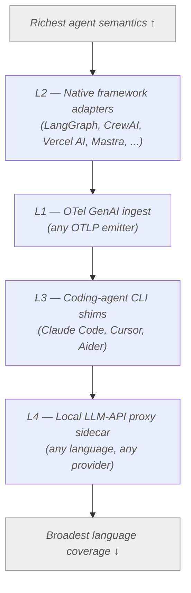

# Replayable

> Capture every step of a production agent run, replay it deterministically, and turn the captured trace into a scoreable regression test.

<!-- TODO: replace placeholders once CI, package registries, and the first tag exist. -->
[](#)
[](LICENSE)
[](#status)

Replayable is the open-source, framework- and language-agnostic toolkit that closes the loop between **agent observability** and **agent evaluation**.
Production traces become first-class CI test cases: re-execute against pinned tools, edit a single step, or score against your own evaluators — without ever re-running prod.

## What is Replayable

**Four-layer capture, one canonical schema.**
Replayable captures agent runs through any combination of four interoperable layers — an OpenTelemetry (OTel) GenAI ingest endpoint (L1), native framework adapters (L2), coding-agent CLI shims (L3), and a local LLM-API proxy sidecar (L4) — and normalises everything into a single OTel-aligned `AgentTrace` schema.
This is the moat: every downstream component (storage, replay, eval, UI) speaks one schema, no matter which language emitted the trace.

**Replay + eval, coupled.**
A stored trace is not just a debugger artifact. It is a scoreable test case.
Re-execute it against pinned tools, swap a system prompt at step 7, or route a single tool live while the rest stay pinned — then re-score against the same evaluators that gated your last CI run.
No competitor — OSS or proprietary — couples capture, deterministic replay, and eval end-to-end.

**Polyglot by default.**
L1 and L4 give meaningful coverage for any language that can speak HTTP or OTLP today.
L2 adapters keep Python and TypeScript stacks deep.
L3 covers the coding-agent CLIs (Claude Code, Cursor, Aider) that nobody else instruments at all.
Hermes-style `<tool_call>` XML is preserved verbatim — open-model users get the same first-class treatment as OpenAI tool-calling.

## What makes it different

- **The only OSS replay-driven eval.** Every other OSS eval framework re-executes your agent live; we score the captured trace.
- **The only OSS agent tracer with a published <2% p50 / <5% p99 overhead SLO**, enforced by CI on every release against a locked reference workload.
- **Framework- and language-agnostic via four-layer capture.** L1+L4 cover every quadrant nobody else covers; L2+L3 keep Python, TypeScript, and coding-agent stacks deep.

## Quick start (local)

> Heads-up: v0.0.1 is a pre-alpha scaffold.
> The infrastructure containers start, but the L4 proxy and SDKs are stubs — no real capture, replay, or eval yet.
> The commands below verify the stack boots; see [Status](#status) for what works end-to-end.

```bash
# 1. Clone
git clone https://github.com/replayable/replayable.git
cd replayable

# 2. See available build targets
make help

# 3. Bring up the local storage services (ClickHouse + Postgres)
docker compose -f infra/docker-compose.yml up -d
```

Tear down with `docker compose -f infra/docker-compose.yml down`.
Run the full polyglot validation suite with `make check`.

## Architecture in 60 seconds

Replayable is organised as four capture layers feeding one canonical schema, one storage tier, one API server, and one UI.



Prefer L2 when you can — it produces the richest agent-semantic spans.
Fall back through L1, L3, and L4 in that order as native instrumentation thins out.
Every layer normalises into the same `AgentTrace` schema, so replay and eval work identically regardless of the capture source.

See [`docs/ARCHITECTURE.md`](docs/ARCHITECTURE.md) for the full C4 breakdown, performance budgets, and deployment topology.

## Status

**v0.0.1 — pre-alpha scaffold.**

What works today:

- Monorepo scaffold for Rust (L4 proxy), Go (ingest collector + `agentctl`), Python (SDK, server, adapters), and TypeScript (SDK, adapters, UI).
- `docker compose -f infra/docker-compose.yml up` brings up ClickHouse + Postgres.
- `make check` runs the polyglot lint, type, and test suite end-to-end.
- GitHub Actions workflow gates every PR on the same `make check`.

What is coming next:

- **v0.1.0** — End-to-end capture path for one L2 adapter (LangGraph), trace storage, read-only trace inspection UI, and the canonical `AgentTrace` schema implemented per [ADR-0001](docs/adr/0001-canonical-trace-schema.md).
- **v0.2.0** — L4 proxy with streaming SSE tee, deterministic replay against pinned tools, and the deterministic evaluator set.
- **v1.0** — All four capture layers, replay + counterfactual replay, eval cascade with LLM judges + judge cache, CI GitHub Action, and the NeMo Agent Toolkit exporter plugin.

Per-feature progress lives in the issue tracker.
Per-component status lives in each package's `README.md`.

## Learn more

- [`docs/ARCHITECTURE.md`](docs/ARCHITECTURE.md) — system design, container map, performance budgets.
- [`docs/PRD.md`](docs/PRD.md) — product requirements, target users, scope, success metrics.
- [`docs/adr/`](docs/adr/) — locked architectural decisions (schema, storage, proxy language, replay contract, eval cascade).
- [`docs/STYLE.md`](docs/STYLE.md) — writing conventions for documentation contributors.
- [`CONTRIBUTING.md`](CONTRIBUTING.md) — how to make a useful PR.
- [`SECURITY.md`](SECURITY.md) — responsible-disclosure process.

## License

Apache-2.0.
See [`LICENSE`](LICENSE).
